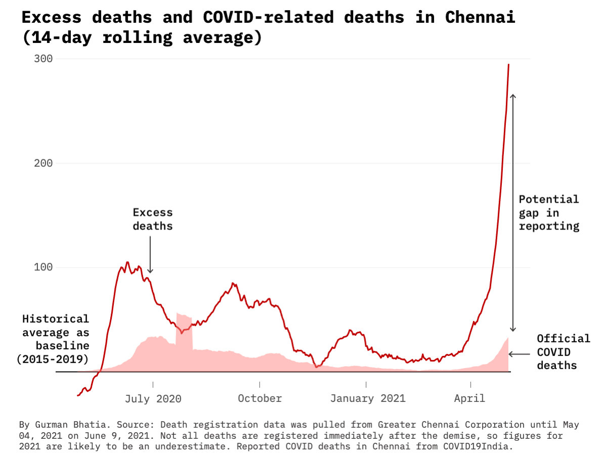

# Registered Deaths, COVID Deaths and Excess mortality in Chennai

Repository contains the following: 

1) Registered deaths in Greater Chennai Corporation from 2008 - May 2021.
	- [By date](https://flatgithub.com/gurmanbh/chennai-registered-deaths-excess-mortality?filename=data%2Fby-date.csv&filters=&sha=b5641e00448585cce53c902c872fc02fc79061b0&sort=date%2Cdesc&stickyColumnName=date)
	- [By month](https://flatgithub.com/gurmanbh/chennai-registered-deaths-excess-mortality?filename=data%2Fby-month.csv&filters=&sha=b5641e00448585cce53c902c872fc02fc79061b0&sort=month%28date%29%2Cdesc&stickyColumnName=month%28date%29)
	- [By day and sex](https://flatgithub.com/gurmanbh/chennai-registered-deaths-excess-mortality?filename=data%2Fby-date-sex.csv&filters=&sha=b5641e00448585cce53c902c872fc02fc79061b0&sort=month%28date%29%2Cdesc&stickyColumnName=month%28date%29)
2) Excess mortality calculated from registered deaths and compared with reported COVID deaths. [Data](ered-deaths-excess-mortality?filename=data%2Fexcess-deaths.csv&filters=&sha=b5641e00448585cce53c902c872fc02fc79061b0&sort=Date%2Cdesc&stickyColumnName=Date)
3) Charts illustrating the extent

Note: All figures were last updated on 27 May, 2021. As explained by [Rukmini S in this story](https://www.thehindu.com/opinion/op-ed/interpreting-deaths-in-chennai/article34645264.ece), the data for 2021 (in particular, April and May), is likely to be an underestimate as people have up to an year to register deaths. Because of the same, the charts end at April 30, 2021. I plan on updating this repository periodically.

---------
## What is excess mortality?

Excess deaths are calculated by taking a historical average to borrow from a _normal year_ and comparing it with a _pandemic year_ to look the extent of deaths that are above the normal.

As the second wave of the pandemic sweeps through the country, and reported numbers are proven to be [underreported](https://www.indiaspend.com/covid-19/mortality-data-kerala-mumbai-too-soon-to-say-india-covid19-less-deadly-second-wave-737270) [time](https://twitter.com/deepakpatel_91/status/1393070596741734405?s=20) [and](https://twitter.com/deepakpatel_91/status/1397420984592908291?s=20) [again](https://twitter.com/deepakpatel_91/status/1397447291707875334?s=20), excess mortality figures can help us with better estimates of the true toll of the pandemic. This borrows from our experience of [previous pandemics](https://indianexpress.com/article/opinion/columns/why-excess-mortality-figures-for-covid-must-be-calculated-7330348/), where the recorded number of deaths was much lower than the actual number. 

----------

## Chennai's Factor
For the period between April 27, 2020 and April 30, 2021, Chennai recorded the following numbers

- Registered Deaths: 78,924
- COVID Deaths:  4,729

The 5 year average for the same period between 2015 - 2019 is 63,090 deaths.

Under-reporting factor = (Registered Deaths - Historical Avg) / COVID Deaths

The brings the current under-reporting factor for the city at 3.35.

Based on the Economist's Excess Mortality chart. See how to read the chart [here](https://www.economist.com/graphic-detail/coronavirus-excess-deaths-tracker).

----------

Another Chennai based doctor has also been [scraping the data](https://github.com/elseasama/covid19chennai). 
